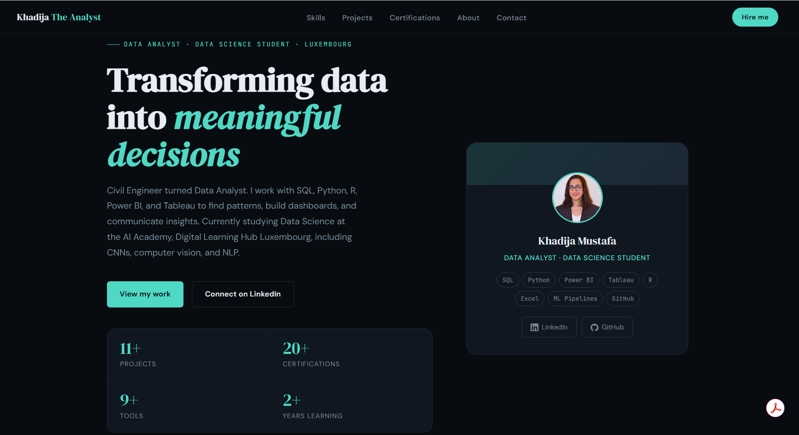

# khadijatheanalyst.github.io

My personal portfolio site, built and hosted on GitHub Pages at [khadijatheanalyst.github.io](https://khadijatheanalyst.github.io).

*(Replace this with a screenshot of the live site homepage. Export it as a PNG, commit it to a visuals/ folder, and update the path above.)*

---

## About This Project

A data analyst's website should not look like a template someone forgot to customize. This site is built on the Massively template by HTML5 UP, but reworked to actually showcase real, working projects rather than placeholder text: the loan default prediction model, a World Cup 2026 predictor, and the rest of the SQL, Excel, Power BI, and Tableau work live here.

## The Story

I came into data analytics from civil engineering, by way of founding and running LetzPick, an e-commerce business, for three years. That background shows up in how the site is organized: it is not just a list of notebooks, it is framed as a body of work meant to answer the question a hiring manager actually asks, which is "can this person ship something real," not just "do they know pandas."

Keeping it plain HTML/CSS/JavaScript instead of reaching for a framework was a deliberate choice too. For a single-page portfolio that updates a few times a month, a build step and a framework would have been more overhead than the site is worth, and plain HTML means anyone can view-source it and understand exactly how it works.

## What's Implemented

- About section with background, skills, and current learning journey
- Project cards for SQL, Excel, Power BI, Tableau, and Python work
- Featured ML project cards: loan default prediction, World Cup 2026 predictor
- Contact section with email and LinkedIn

## What's Next

- Add the Luxembourg demographics and ML Engineering coursework projects as cards
- Add screenshots or GIFs to each project card instead of text-only descriptions
- Consider a lightweight blog section for write-ups like this one
## The Hardest Part

Resisting the urge to over-engineer it. It would have been easy to reach for React or a static site generator to feel more "modern," but that would have added a build pipeline for a site that is fundamentally a handful of sections and a set of project cards. The actual hard part was editorial, not technical: deciding which projects earn a spot on the homepage and which stay in their own repos, since a portfolio that shows everything shows nothing in particular.

## Tools

HTML5, CSS3, JavaScript, Massively template (HTML5 UP), GitHub Pages

## About the Developer

**Khadi(ja)**, Data Analyst based in Luxembourg, currently in the AI Academy at Digital Learning Hub Luxembourg, training as an ML Engineer. Previously founded and ran LetzPick, an e-commerce business in Luxembourg.
[LinkedIn](https://www.linkedin.com/in/khadija-mustafa-98344527b/) · [Portfolio](https://khadijatheanalyst.github.io) · [GitHub](https://github.com/KhadijaTheAnalyst)
